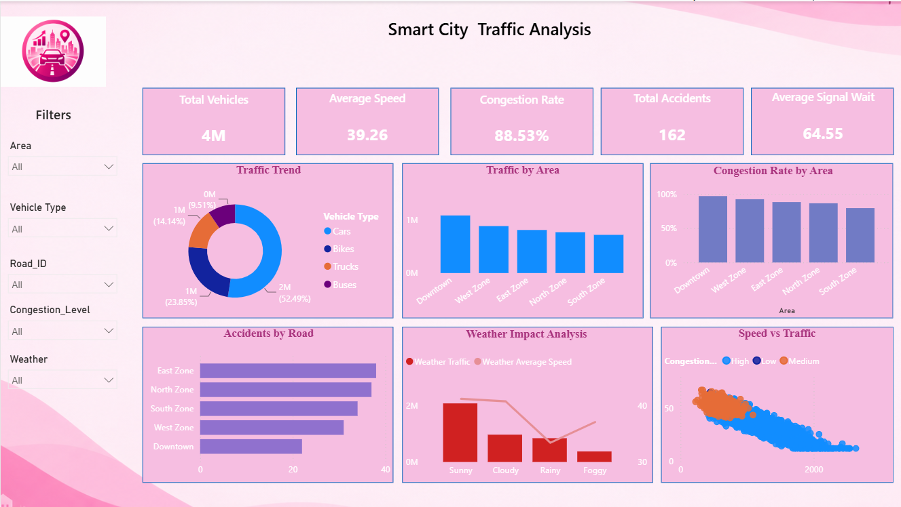

# Smart City Traffic Analytics

## 📊 Project Overview

**Smart City Traffic Analytics** is an end-to-end data analytics project designed to analyze urban traffic patterns, vehicle movement, congestion levels, accident-prone roads, weather impact, and signal waiting time.

The project uses **Power BI** to transform raw traffic data into meaningful insights through an interactive dashboard.

## 🎯 Project Objectives

- Analyze total vehicle movement across city areas.
- Identify peak traffic hours.
- Measure congestion levels.
- Compare average speed across areas and roads.
- Analyze vehicle type distribution.
- Identify roads with higher accident counts.
- Understand the impact of weather on traffic.
- Analyze average signal waiting time.
- Present insights through an interactive Power BI dashboard.

## 🛠️ Tools and Technologies

| Tool | Purpose |
|---|---|
| Power BI | Dashboard development and visualization |
| DAX | Measures and calculated columns |
| CSV | Dataset format |

## 📁 Project Structure

```text
Smart-City-Traffic-Analytics/
│
├── Dataset/
│   └── smart_city_traffic_analytics_4000.csv
│
│
├── PowerBI/
│   └── Smart_City_Traffic_Analytics.pbix
│
├── Images/
│   └── dashboard.png
│
└── README.md
```

## 📂 Dataset Description

The dataset contains **4,000 traffic records** and includes the following fields:

| Column | Description |
|---|---|
| `Record_ID` | Unique record identifier |
| `Date` | Traffic observation date |
| `Time` | Traffic observation hour |
| `Road_ID` | Road name or identifier |
| `Area` | City area or zone |
| `Vehicle_Count` | Total number of vehicles |
| `Car_Count` | Number of cars |
| `Bus_Count` | Number of buses |
| `Bike_Count` | Number of bikes |
| `Truck_Count` | Number of trucks |
| `Avg_Speed_kmph` | Average traffic speed in km/h |
| `Congestion_Level` | Low, Medium, or High |
| `Signal_Wait_Time_sec` | Signal waiting time in seconds |
| `Accident_Count` | Number of recorded accidents |
| `Weather` | Weather condition during observation |

> **Note:** The dataset is suitable for learning, portfolio development, dashboard practice, and demonstration purposes.

## 📈 Dashboard Features

### KPI Cards

- Total Vehicles
- Average Speed
- Congestion Rate
- Total Accidents
- Average Signal Wait Time

### Visualizations

- Traffic Trend by Month
- Peak Hour Traffic Analysis
- Vehicle Type Distribution
- Congestion by Area
- Accidents by Road
- Weather Impact Analysis
- Average Speed by Area
- Traffic Volume vs Average Speed

### Filters

- Date Range
- Area
- Road ID
- Congestion Level
- Weather

## 🧮 Important DAX Measures

### Total Vehicles

```DAX
Total Vehicles =
SUM(Traffic_Data[Vehicle_Count])
```

### Average Speed

```DAX
Average Speed =
AVERAGE(Traffic_Data[Avg_Speed_kmph])
```

### Total Accidents

```DAX
Total Accidents =
SUM(Traffic_Data[Accident_Count])
```

### Average Signal Wait

```DAX
Average Signal Wait =
AVERAGE(Traffic_Data[Signal_Wait_Time_sec])
```

### High Congestion Records

```DAX
High Congestion Records =
CALCULATE(
    COUNTROWS(Traffic_Data),
    Traffic_Data[Congestion_Level] = "High"
)
```

### Congestion Rate

```DAX
Congestion Rate =
DIVIDE(
    [High Congestion Records],
    COUNTROWS(Traffic_Data),
    0
)
```

### Total Cars

```DAX
Total Cars =
SUM(Traffic_Data[Car_Count])
```

### Total Bikes

```DAX
Total Bikes =
SUM(Traffic_Data[Bike_Count])
```

### Total Buses

```DAX
Total Buses =
SUM(Traffic_Data[Bus_Count])
```

### Total Trucks

```DAX
Total Trucks =
SUM(Traffic_Data[Truck_Count])
```


## 🔄 Project Workflow

```text
CSV Dataset
     ↓
Power BI Data Model
     ↓
DAX Measures
     ↓
Interactive Dashboard
     ↓
Traffic Insights
```

## 💡 Possible Business Insights

This project can help identify:

- The busiest city areas.
- Peak traffic hours.
- Roads with relatively high accident counts.
- Areas with lower average speeds.
- Weather conditions associated with traffic changes.
- Vehicle categories contributing most to traffic volume.
- Locations where traffic signal waiting time may require further investigation.

## 🖼️ Dashboard Preview


```markdown

```

## 🚀 How to Use This Project

1. Download or clone this repository.
2. Open the CSV file in Power BI.
3. Clean and validate the dataset.
4. Run the analysis queries.
5. Open Power BI Desktop.
6. Load the CSV or connect to the SQL database.
7. Create the required DAX measures.
8. Build the dashboard visuals.
9. Add slicers and format the dashboard with a pink theme.

## 🎨 Dashboard Theme

The dashboard uses a pink and white design.

| Element | Color |
|---|---|
| Primary Pink | `#D81B60` |
| Light Pink | `#FCE4EC` |
| Sidebar Pink | `#F7A8C4` |
| Dark Pink | `#8E1645` |
| Background | `#FFF5F8` |

## 📌 Future Enhancements

- Real-time traffic data integration.
- GPS-based traffic mapping.
- Traffic forecasting.
- Automated accident alerts.
- Traffic signal optimization analysis.
- Integration with live weather data.
- Machine learning-based congestion prediction.

## 👩‍💻 Author

**Vijayalakshmi R**

This project was created as a portfolio project to demonstrate practical skills in Excel, SQL, Power BI, DAX, and data visualization.

## ⭐ If You Find This Project Useful

Give this repository a ⭐ and feel free to use it for learning and portfolio development.
